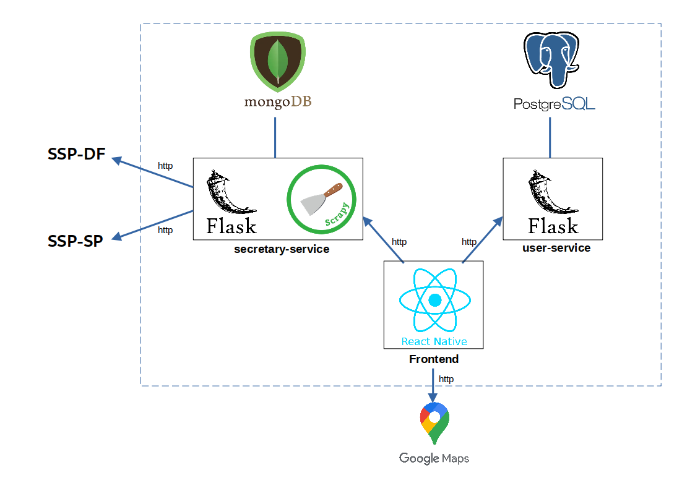
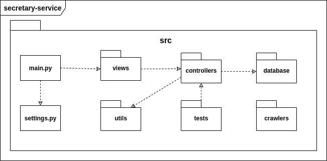
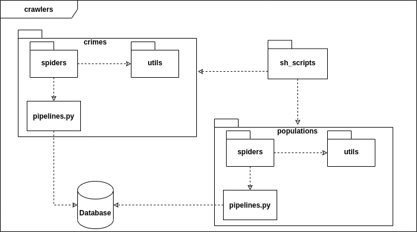
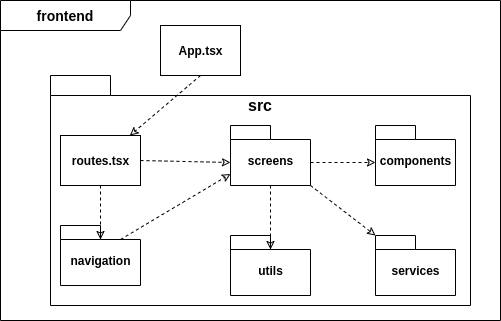
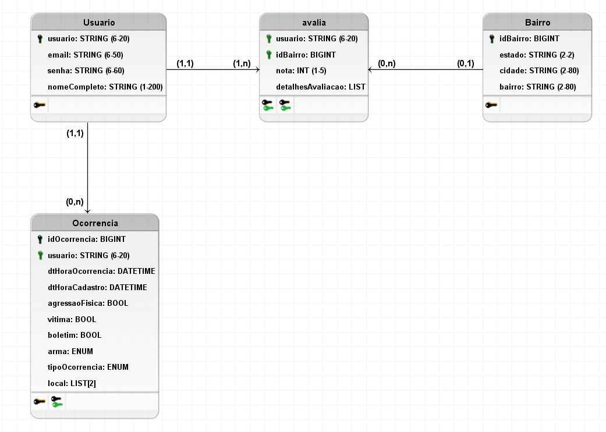

# Documento de Arquitetura

## 1. Introdução

### 1.1. Finalidade

Este documento tem como objetivo fornecer uma visão geral da arquitetura do aplicativo Stay Safe. Visa apresentar de forma clara o fluxo de dados, o comportamento da aplicação e como as partes se relacionam, bem como expor de maneira objetiva as decisões arquiteturais que foram tomadas em relação ao projeto.

### 1.2. Escopo

Este documento de arquitetura se aplica ao Stay Safe. Estão descritos neste documento os padrões de arquitetura adotados, frameworks e linguagens escolhidas.

### 1.3. Definições, Acrônimos e Abreviações

* **API** - *Application Programming Interface*: conjunto de rotinas e padrões de programação que viabiliza a comunicação entre dois sistemas ou plataformas distintas.
* **HTTP** - *Hypertext Transfer Protocol*: protocolo de transferência e comunicação de dados.
* **Backend** - Parte da aplicação responsável pela conexão com o banco de dados e gerência das informações que serão enviadas ao frontend.
* **Frontend** - Parte da aplicação responsável pela interação com o usuário, utilizando recursos consumidos do backend.
* **SSP** - Secretaria de Estado de Segurança Pública.
* **SQL** - *Structured Query Language*: Linguagem declarativa de busca para bancos de dados relacionais.
* **JSON** - JavaScript Object Notation
* **REST** - Representational State Sransfer

## 2. Representação Geral da Arquitetura


A aplicação tem um cliente de frontend mobile feito em React Native, dois microserviços em seu backend e está fazendo o uso da API do Google Maps para os mapas do aplicativo.

Um dos microserviços é o User Service, uma API REST desenvolvida em Flask, que trata todos os dados dos usuários, ocorrências reportados e avaliações submetidas, enviando-os para serem armazenados em um banco de dados relacional, PostgreSQL.

O segundo microserviço é o Secretary Service que obtém as informações dos websites da SSP por meio de crawlers Scrapy e as armazena em um banco de dados não relacional, MongoDB. Da mesma forma, porém de origem diferente, estão sendo obtidos nesse serviço os dados populacionais das cidades de cada estado. Esses dados são expostos em uma API do serviço também feita em Flask. Por fim o aplicativo irá utilizar a API do Google Maps para exibir os mapas das funcionalidades.

As comunicações entre todos os componentes são feitas com o protocolo HTTP e o tipo de conteúdo transmitido dentro do sistema é documento JSON.

## 3. Tecnologias
O diagrama abaixo mostra quais são as tecnologias usadas em cada parte do sistema. Em seguida, essas tecnologias são descritas brevemente.



### 3.1. Flask
[Flask](https://flask.palletsprojects.com/en/1.1.x/#) é um microframework de aplicativos web em Python. Foi designado para se ter um início de desenvolvimento simples, com a habilidade de escalar para aplicações complexas. Flask oferece sugestões, mas não força dependências e layouts ao projeto.

### 3.2. Scrapy
[Scrapy](https://scrapy.org/) é um framework de alto nível de web-crawling em Python. Ele fornece algumas facilidades para rastreamento e raspagem de dados da web, como bibliotecas de parse em HTML, pipelines para filtragem e tratamento de dados.

### 3.3. PostgreSQL
[PostgreSQL](https://www.postgresql.org/) é um banco de dados relacional open source que suporta grande parte do padrão SQL. Ele é utilizado no User Service, que precisa de mais persistência dos dados.

### 3.4. MongoDB
[MongoDB](https://www.mongodb.com/) é um banco de dados orientado a documentos não relacional caracterizado como NoSQL. Ele possui uma maior versatilidade para armazenar os dados. Ele é usado no Secretary Service para armazenar os dados obtidos das SSPs, cuja modelagem pode variar entre as secretarias.

### 3.5. React Native
[React Native](https://reactnative.dev/) é um framework em JavaScript para desenvolver aplicações nativas tanto para Android como para IOS. É baseada em React, uma biblioteca do Facebook criada para desenvolver interfaces de usuário, porém em vez de adaptar o código para browsers, ele adapta para dispositivos móveis.

### 3.6. API Google Maps
A [API do Google Maps](https://developers.google.com/maps/documentation?hl=pt-br) é utilizada para obter os mapas da aplicação, onde é feita a inclusão dos marcadores de ocorrências e avaliações reportados pelos usuários e a inclusão das demarcações e coloração das cidades de acordo com os dados obtidos da SSP.


## 4. Requisitos e Restrições de Arquitetura

* Aplicação deve ser construída baseada na arquitetura de microsserviços, na qual o backend será desenvolvido em Flask e o frontend em React Native.

* O aplicativo será funcional em celulares com o sistema operacional Android e acesso à loja de aplicativos Play Store.

* O celular necessita de conexão estável de internet para uso completo e atualizado do aplicativo.

* O secretary-service deve ser desenvolvida para consumir dados de diferentes secretarias, portanto deve ser facilmente escalável.

* O serviço de mapas da aplicação será fornecido pela API externa do Google Maps.

## 5. Visão de Implementação

### 5.1. User-Service

Este serviço tem como base o conjunto de princípios do padrão [REST](https://restfulapi.net/). Ele possui três camadas (View, Controller e Database) com funções e responsabilidades bem estabelecidas, o que permite uma estruturação do serviço que facilita a delegação de tarefas, a manutenção e a evolução. Em sua implementação, os seguintes módulos são usados:


* **src/** - Diretório que contém todo o código fonte da API.
* **main.py** - Arquivo que tem a responsabilidade de inicializar o serviço. Nele é criada a instância da aplicação utilizada para sua execução através do uso das configurações já estabelecidas, e também é realizado o registro das rotas (blueprints) criadas nas views.
* **settings.py** - Arquivo que contém todas as configurações do servidor e de log.
* **views/** - Diretório que implementa as views que são as portas de entrada e saída do serviço, nele são definidos os endpoints e quais métodos HTTP são utilizados.
* **controllers/** - Diretório que implementa as controllers do serviço para itermediar a comunicação entre as camadas de database e a de view. As controllers são responsáveis pela validação dos dados de entrada e demais regras de negócio.
* **database/** - Diretório responsável pela comunicação com o banco de dados relacional. Nele há dois arquivos: *models.db* e *db.py*. O primeiro é responsável pela implementação de *models* do [SQLAlchemy](https://www.sqlalchemy.org/) que são a representação das tabelas no banco. O segundo é reponsável por realizar a conexão com o banco e as operações (leitura, inserção, deleção e edição).
* **utils/** - Diretório onde se encontram os utilitários do projeto, como arquivos para formatação e validação de dados, além da declaração de constantes utilizadas no código.
* **tests/** - Contém os testes unitários realizados sobre as funcionalidades das controllers.

O diagrama abaixo demonstra a interação entre as partes do serviço:


### 5.2. Secretary-Service

Este serviço possui os mesmos princípios do User-Service, porém além da API ele tem um módulo de crawler. Na API as camadas são as mesmas do User-Service, mas com menos responsabilidades por ser mais simples. No módulo crawlers há crawlers para os sites das secretarias e terá também para obtenção dos dados populacionais de cada cidade. 


* **src/** - Diretório que contém todo o código fonte da API.
* **main.py** - Arquivo que tem a responsabilidade de inicializar o serviço. Nele é criada a instância da aplicação utilizada para sua execução através do uso das configurações já estabelecidas, e também é realizado o registro das rotas (blueprints) criadas nas views.
* **settings.py** - Arquivo que contém todas as configurações do servidor e de log.
* **views/** - Diretório que implementa as views que são as portas de entrada e saída do serviço, nele são definidos os endpoints e quais métodos HTTP são utilizados.
* **controllers/** - Diretório que implementa a controller do serviço para itermediar a comunicação entre as camadas de database e a de view. A controllers está sendo responsável pela validação dos filtros e demais regras de negócio.
* **database/** - Diretório responsável pela comunicação com o banco de dados não relacional. Nele é feita a conexão com o banco.
* **utils/** - Diretório onde se encontram os utilitários do projeto, como arquivos para formatação e validação
* **tests/** - Contém os testes unitários realizados sobre as funcionalidades da controller.
* **crawlers/** - Responsável pela implementação dos crawlers, com Scrapy e eventualmente [Selenium](https://www.selenium.dev/), que realizam a extração metódica e automatizada de dados das SSPs e dos dados sobre a população das cidades. 

O diagrama abaixo demonstra a interação entre as partes do serviço:


#### 5.2.1 Crawlers

Para a extração dos dados das SSPs é usada uma [spider](https://docs.scrapy.org/en/latest/topics/spiders.html) pra cada secretaria, porém o resultado produzido é o mesmo, ou seja, a forma como os dados são obtidos podem variar entre as secretarias mas no banco eles não possuem diferença de modelagem. O mesmo acontece para extração de dados populacionais das cidades de cada estado.

Nesse módulo também há uso de crontab que é um agendador de tarefas baseado em tempo em sistemas operacionais tipo Unix.

Os componentes desse módulo são descritos aqui de forma superficial: 

* **crimes/** - Diretório que contém as spiders, utilitários e pipelines de extração de dados sobre crimes, que serão obtidos dos sites das SSPs.
* **populations/** - Diretório com as spiders, utilitários e pipelines de extração de dados populacionais das cidades.
* **sh_scripts/** - Diretório onde ficam os scripts shell que vão disparar os crawlers de forma programada com o uso de crontabs.

O diagrama abaixo demonstra a interação entre esses componentes:


### 5.3. Frontend

O frontend está sendo implementado com uma organização em que cada módulo possui responsabilidades bem definidas, facilitando assim a manutenção e evolução do código:

* **App.tsx** - Arquivo que chama o componente principal do app que são as rotas.
* **src/** - Diretório que contém basicamente todo o código fonte.
* **routes.tsx** - Arquivo responsável por carregar todas as telas. Para isso ele utiliza os módulos de navigation e de screens.
* **navigation/** - Diretório que controla o fluxo de navegação entre as telas através *tab bottom bar*. Então ele faz uso do componente de screens.
* **screens/** - Contêm as telas da aplicação. Para que as telas funcionem corretamente, esse módulo utiliza os diretórios de services, de componentes e o de utils.
* **services/** - Diretório que contém os endpoints necessários para realizar as requisões feitas no app.
* **components/** - Inclue os componentes que são comuns às telas da aplicação. Os componentes podem ser modals, inputs de formulários, botões, etc.
* **utils/** - Armazena funções utilitárias reutilizáveis que serão disponibilizadas para todo o frontend. 

O diagrama abaixo mostra de forma mais clara a relação entre esses módulos:



## 6. Dados 

### 6.1 Dados das secretarias
Os dados das secretarias são armazenados no MongoDB em que cada estado é uma *collection* ou tabela.
Exemplo de nome da collection: `crimes_sp` para o estado de São Paulo.

Os objetos ou documentos na *collection* estão seguindo esse modelo com esses crimes:

```json
{
    "_id": 1,
    "capture_data": "04/08/2020",
    "period": {
        "start": "01/2020",
        "end": "07/2020"
    },
    "cities": [
        {
            "Águas Claras": [
                {
                    "crime_nature": "Latrocinio",
                    "quantity": 8
                },
                {
                    "crime_nature": "Roubo a Transeunte",
                    "quantity": 3
                },
                {
                    "crime_nature": "Roubo de Veiculo",
                    "quantity": 8
                },
                {
                    "crime_nature": "Roubo de Residencia",
                    "quantity": 5
                },
                {
                    "crime_nature": "Estupro",
                    "quantity": 15
                },
                {
                    "crime_nature": "Trafico de Entorpecentes",
                    "quantity": 8
                }
            ]
        }
    ]
}
```

#### 6.1.1 Evoluções

Depois de usar o modelo acima, foi percebido pontos de melhoria e outro modelo mais adequado foi proposto e poderá ser implementado em futuras evoluções do serviço:

```
{
    "_id": 1,
    "capture_data": "04/08/2020",
    "period": "1/2020",
    "cities": [
        {
            "name": "Águas Claras",
			"crimes":  [
                {
                    "nature": "Latrocínio",
                    "quantity": 8
                },
                {
                    "nature": "Roubo a Transeunte",
                    "quantity": 3
                },
                {
                    "nature": "Roubo de Veículo",
                    "quantity": 8
                },
                {
                    "nature": "Roubo de Residência",
                    "quantity": 5
                },
                {
                    "nature": "Furto de Veículo",
                    "quantity": 9
                },
                {
                    "nature": "Furto a Transeunte",
                    "quantity": 8
                },
                {
                    "nature": "Estupro",
                    "quantity": 15
                }
            ],
        }
    ]
}
```

### 6.2 Dados das populações das cidades
Os dados populacionais das cidades também são armazenados no MongoDB em que cada estado é uma *collection*. Exemplo de nome para uma collection de população: `populations_df` para o Distrito Federal.

Os objetos ou documentos na *collection* estão seguindo esse modelo:
```
{
    "_id": 1,
    "capture_data": "04/08/2020",
    "year": 2020,
    "cities": [
        {
            "name": "Águas Claras",
			"population": 50000
        },
        {
            "name": "Taguatinga",
			"population": 150000
        }
    ]
}
```


### 6.3 Dados dos usuários

Os dados do usuário estão sendo armazenados no PostgreSQL com a seguinte modelagem:

#### 6.3.1 Diagrama Entidade-Relacionamento
Esse diagrama mostra quais e como são as entidades e os relacionamentos entre elas. 


#### 6.3.2 Diagrama Lógico
O modelo lógico dá mais detalhes de como estão implementadas as tabelas no banco de dados.


Os campos do tipo *enum* tem os seguintes valores possíveis:

* **detalhesAvaliacao (tabela avalia):** ("iluminação ruim", "pouca movimentação de pessoas", "poucas rondas policiais", "boa iluminação", "boa movimentação de pessoas", "rondas policiais frequentes")
* **arma (tabela Ocorrencia)**: ("nenhuma", "de fogo", "branca")
* **tipoOcorrencia (tabela Ocorrencia)**: ("Latrocínio", "Roubo a transeunte", "Roubo de Veículo", "Roubo de Residência" , "Estupro", "Roubo a Transeunte", "Roubo de Veículo")


## 7. Referências

JUNIOR, Cleber; LUI, Brian; HORINOUCHI, Lucas; SOUZA, Rômulo; HERONILDO, Francisco; TOYOSHIMA, Filipe; ALVES, Vitor; APOLINÁRIO, Jacó. Projeto HubCare: Documento de Arquitetura. Disponível em: https://cjjcastro.gitlab.io/2019-1-hubcare-docs/project/architecture-document/#5-visao-de-implementacao. Acesso em: 26 ago. 2020;

LIMA, Alan; BERNARDO, Elias; MARQUES, Guilherme; BARREIROS, Leonardo; BLANCO, Matheus; FÉO, Pedro; RODRIGUES, Pedro; KADER, Saleh; SILVA, Sara; ALCÂNTARA, Shayane. Projeto QR Comer: Documento de Arquitetura. Disponível em: https://fga-desenho-2019-2.github.io/Wiki/seminario5/arquitetura/. Acesso em: 26 ago. 2020;

MENDES, Iasmin; VALÉRIO, Renato; JOÃO, Lucas; DAVI, Gabriel; SOUZA, Sousa; MACIEL, Lucas; FERNANDES, Weiller; GOMES, Matheus. Projeto Indica AI: Documento de Arquitetura. Disponível em: https://fga-eps-mds.github.io/2018.2-IndicaAi//docs/2018/08/28/architecture-doc.html. Acesso em: 26 ago. 2020;

MIGUEL, Alexandre; ALVES, Davi; GUEDES, Gabriela; GOULART, Helena; ROBSON, João; MENEZES, Leticia; GUILHERME, Luiz; SCHADT, Renan; VINICIUS, Rômulo; HUGO, Victor. Projeto Translate.me: Documento de Arquitetura. Disponível em: https://translate-me.github.io/docs/documentos/projeto/doc_de_arquitetura/. Acesso em: 26 ago. 2020;

## Histórico de Revisão

| Data | Versão| Descrição | Autor |
|----|----|----|----|
| 26/08/2020 | 0.1 | Adicionando Introdução | Brenda e Hérick |
| 26/08/2020 | 0.2 | Adicionando Requisitos e Restrições de Arquitetura | Brenda e Hérick |
| 26/08/2020 | 0.3 | Adicionando Visão de Implementação | Brenda e Hérick |
| 26/08/2020 | 0.4 | Adicionando Representação da Arquitetura | Tiago |
| 26/08/2020 | 0.5 | Adicionando Referências | Luiz |
| 26/08/2020 | 0.6 | Revisando Documento | Brenda, Luiz, Hérick, Tiago |
| 29/08/2020 | 1.0 | Revisão e algumas correções | Sara |
| 05/09/2020 | 1.1 | Adicionando modelagem dos dados | Sara e Renan |
| 08/10/2020 | 2.0 | Revisão, correção e atualzação | Sara |
