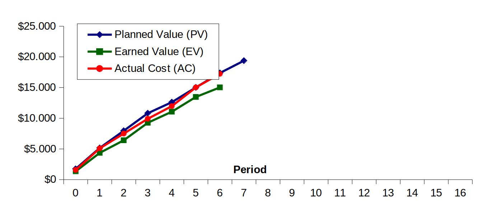

# Plano de Gerenciamento de Custos

## 1. Introdução 
Documento dedicado a definir os custos totais do projeto, considerando os recursos humanos, aquisições, serviços e ferramentas utilizadas. 

## 2. Orçamento

### 2.1 Recursos Humanos
O orçamento de recursos humanos foi feito com base na [média salarial de desenvolvedores e gerentes júnior](https://www.glassdoor.com.br/) e na média de horas semanais individuais dedicadas a matéria (10h).

Os salários que encontramos foram de em média 2.880 para desenvolvedores júnior e 4.500 para gerentes de projetos júnior.

| Cargo | Quantidade | Custo/Hora | Horas Dedicadas | Montante Final Individual | Montante Final Geral |
|---|---|---|---|---|---|
| Desenvolvedor Júnior | 7 | R$ 18 | 170 | R$ 3.060 | R$ 21.420 | 
| Gerente Júnior | 3 | R$ 28.10 | 170 | R$ 4.777 | R$ 14.331 |

### 2.2 Aquisições
Nas aquisições o notebook especificado possui processador i5, 8 Gb de memória RAM e 256 Gb de SSD, o que seria uma especificação adequada para desenvolver o aplicativo e rodar simulações no notebook para testá-lo.

| Equipamento | Quantidade | Finalidade | Valor Unitário | Valor Total |
|---|---|---|---|---|
| Notebook | 10 | Desenvolvimento e Teste | R$ 3.500 | R$ 35.000 |
| Deploy Play Store | 1 | Realizar deploy na Play Store | R$ 125 | R$ 125 |

### 2.3 Serviços
No serviço de internet a equipe consultou o valor e a banda das operadoras disponíveis no Distrito Federal e encontrou planos de 100 Mb de internet por R$ 140, a simulação é de um contrato de 5 meses (duração aproximada do projeto) para cada membro.

O consumo de energia de um notebook em uso normal do perfil listado acima é [em torno de 38W](https://www.notebookcheck.net/Acer-Aspire-5-A515-54G-Review-Laptop-for-Casual-Gamers.459883.0.html#toc-emissions-energy-management). Ele será usado para trabalho durante duas horas no dia, cinco dias na semana.

Para fazer o cálculo de quantos kWh/mês se utiliza a fórmula: **Potência do aparelho (W) x Número de horas utilizadas (h) x Número de dias utilizados por mês x Dividido por 1000**. 
    
    Dessa forma: 38 * 2 * 20 / 1000 = 1,52 kWh/mês por pessoa. 
    
A [CEB cobra 66 centavos por kWh/mês](http://simuladortarifabranca.ceb.com.br/public/index/step-resultado/perfil/2). O que retorna um resultado de aproximadamente 1 R$ de consumo de energia para cada notebook no mês considerando somente as horas de trabalho. 

Quanto ao deploy a equipe vai fazê-lo só nos dois meses finais do projeto, ele será feito na Digital Ocean (que cobra 5 dólares ao mês no servidor mais básico), utilizaremos um para cada repositório backend, totalizando um custo de 10 dólares por mês.

| Serviço | Quantidade | Finalidade | Valor Unitário | Valor Total |
|---|---|---|---|---|
| Internet | 10 | Desenvolvimento e Teste | R$ 700 | R$ 7.000 |
| Energia | 10 | Desenvolvimento e Teste | R$ 5 | R$ 50 |
| Digital Ocean | 2 | Servidor para os serviços do backend | R$ 55 | R$ 110 |

### 2.3 Ferramentas
A única ferramenta paga utilizada é a API do Google Maps, a Google fornece até 200 dólares de créditos mensais gratuitamente para uso desta API, não iremos superar o valor dessa alíquota fornecida e portanto o uso da API será gratuito para o grupo.

| Ferramenta | Finalidade | Custo |
|---|---|---|
| Telegram | Comunicação e realização de dailies | R$ 0 |
| GitHub | Hospedagem e versionamento de código | R$ 0 |
| GitHub Actions | Ferramenta de integração contínua | R$ 0 |
| GitHub Pages | Repositório visual da documentação | R$ 0 |
| Google Drive | Preenchimento de artefatos colaborativos | R$ 0 |
| Google Meet | Reuniões por chamada | R$ 0 |
| Google Maps API | Reuniões por chamada | R$ 0 |
| Flask | Framework backend | R$ 0 |
| React Native | Framework frontend | R$ 0 |
| MongoDB | Banco de dados não relacional | R$ 0 |
| PostgreSQL | Banco de dados relacional | R$ 0 |
| Docker | Ferramenta de containerização | R$ 0 |
| MkDocs | Repositório Visual da Documentação | R$ 0 |

### 2.4 Custo Total
Somando os custos de pessoal, aquisições, serviços e ferramentas o custo total do projeto é de R$ 78.036.

## 3. EVM
O Earned Value Management (EVM) é uma métrica utilizada para integrar escopo, tempo e custo em gerência de projetos, que consiste em medir objetivamente o desempenho e o progresso do projeto comparando custos (real e planejado) e valor agregado. 

### 3.1. EVM até Release 1

## 4. Referências
* [Site de vagas](https://www.glassdoor.com.br/)
* [API do Maps](https://cloud.google.com/maps-platform/pricing/)
* [Tarifa CEB](http://simuladortarifabranca.ceb.com.br/public/index/step-resultado/perfil/2http://simuladortarifabranca.ceb.com.br/public/index/step-resultado/perfil/2)
* [Referência do consumo de energia de um notebook](https://www.notebookcheck.net/Acer-Aspire-5-A515-54G-Review-Laptop-for-Casual-Gamers.459883.0.html#toc-emissions-energy-management)
* [Digital Ocean](https://www.digitalocean.com/pricing/calculator/)
* [Cálculo consumo de energia](https://www.magazineluiza.com.br/portaldalu/calcule-o-consumo-de-energia/5521)