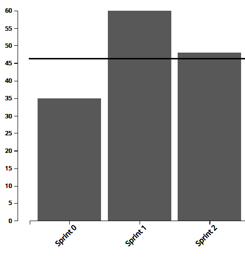
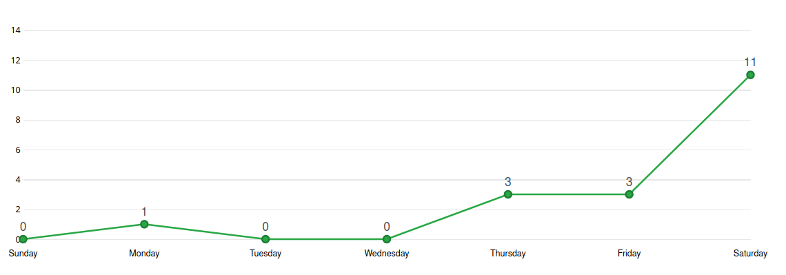

# Análise e Retrospectiva

## 1. Visão Geral
**Número da Sprint:** 2  
**Data de Início:** 30/08/2020  
**Data de Término:** 05/08/2020  
**Duração:** 7 dias  
**Pontos Planejados:** 56 pontos  
**Pontos Entregues:** 41 pontos  
**Dívida Técnica:** 15 pontos  
**Membros Presentes:** Todos

## 2. Resultados
* Obter os dados de ocorrências a partir da base SSP-SP - Hérick, Brenda - 8 pts - Concluído
* Integração com API do Google Maps - Daniel - 5 pts - Concluído
* CRUD de avaliação de bairro - Lucas, Luiz - 5 pts - Concluído
* Validação e integração do cadastro com o backend - Ítalo e Tiago - 3 pts - Concluído
* Criação de tela de login - Ítalo e Tiago - 3 pts - Concluído
* EAP - Renan, Rossicler, Sara - 3 pts - Concluído
* Configuração do Mongo no Docker secretary-service - Rossicler - 3 pts - Concluído
* Criação dos docs da sprint 4 - Renan - 5 pts - Concluído
* Proteger dados e ações do usuário - Sara - 3 pts - Concluído

## 3. Velocity

## 4. Burndown

## 5. Gráfico de Contribuições

### 5.1 Contribuições na Documentação

### 5.1 Contribuições no User-Service
A ser adicionado 

## 6. Retrospectiva
### Pontos Positivos:
* Sem dívida técnica
* Padrão e qualidade de código mantido apesar da inexperiência da equipe
* Algumas tarefas entregues com antecedência
* Combinação de horários
* Disponibilidade de EPS para parear e tirar dúvidas
* Brenda e Hérick gostaram de mexer com crawler
* Lucas gostou da história e aprendeu decorators do Python
* Tiago gostou de testes no user-service
* Frontend maduro e funcional

### Pontos Negativos:
* Algumas histórias começaram tardiamente
* Ainda existem melhoras a serem feitas na comunicação
* Alguns membros de MDS tiveram problemas com a estação de trabalho
* Membro sobrecarregado 

### Melhorias:
* Começar as histórias mais cedo
* Comunicar sempre
* Honrar os compromissos assumidos

## 7. Quadro de Conhecimentos

## 8. Análise do Scrum Master
### Time
Terceira sprint do projeto marcada mais por pontos negativos do que positivos, apesar de muita coisa ter sido entregue a equipe não se comportou como esperado. Os membros de EPS sentem que poderiam ter planejado melhor as histórias e acompanhado melhor MDS ao longo da semana, enquanto a equipe de MDS sabe que começou a fazer as tarefas muito tardiamente. Todos os membros estão empenhados em mudar isso na próxima sprint.

Apesar dos pontos mencionados a equipe continua bem unida e animada com o projeto e a matéria, temos a noção de que essa sprint foi um ponto fora da curva. Uma medida que o time de EPS está tomando é destacar comportamentos positivos que queremos incentivar e recomendar a toda equipe, alguns membros de MDS estão tomando ações que nos surpreenderam positivamente em relação a isso e estão ajudando a moldar o comportamento que esperamos da equipe. 

### Métricas
O **Burndown** da Sprint 2 contém um erro, ele só foi recolhido de maneira apropriada após a resolução das dívidas técnicas, por esse motivo ele mostra que os 48 pontos foram concluídos, sendo que 15 só foram concluídos no início da Sprint 3. De toda forma é notável que as tarefas foram entregues na última hora.

O **Velocity** apresenta o mesmo problema citado no Burndown, a sua medida correta seria de 42.66 pontos por sprint.

Os **Históricos de Contribuição** apresentam uma quantidade pequena de commits no começo e meio da semana o que mostra que as tarefas foram iniciadas tardiamente.

O **Quadro de Conhecimento** mostra evolução principalmente nos membros responsáveis por realizar a funcionalidade de CRUD do usuário.

### Histórias
A primeira tarefa de código do projeto foi o **CRUD do Usuário** que foi completada e entregue testada pelo time de MDS, o time de EPS só auxiliou em alguns ajustes finais.

A **Modelagem do Banco de Dados** foi feita de forma relacional para o User-Service e de forma não relacional para o Secretary-Service, os artefatos gerados a partir da modelagem foram incluídos no **Documento de Arquitetura**.

O **Protótipo de Alta Fidelidade** ficou como dívida para próxima sprint, a tarefa é de um tamanho considerável e levou mais tempo que o esperado para ser executada, algumas dificuldades com a ferramenta de prototipação acabaram atrasando o proceso. A atualização do **Roadmap do Produto** também ficou como dívida para próxima sprint, o time de EPS se sentiu sobrecarregado com as outras demandas exigidas pelo projeto e decidiu por não priorizar essa tarefa na sprint.

O **Termo de Abertura do Projeto** e a **Política de Contribuição** tomaram mais trabalho que o esperado pela equipe, foram concluídos, mas acabaram por atrasar outras tarefas da sprint. A priorização do primeiro foi feita por ser fundamental ao projeto e a do segundo foi devido ao fato de que MDS está entrando nas primeiras issues de código e é fundamental que saibam exatamente como contribuir.

As demais tarefas são auto-explicativas e ocorreram sem intercorrências.