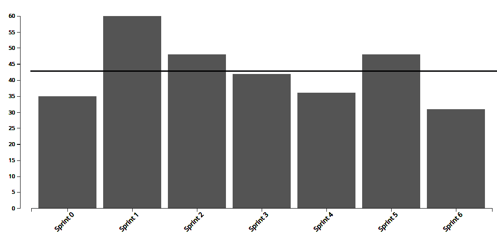
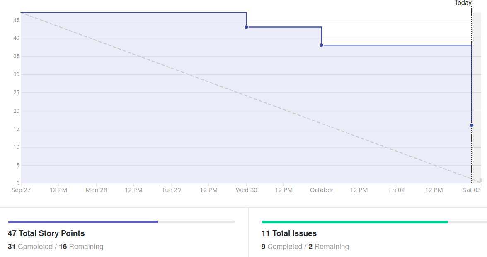
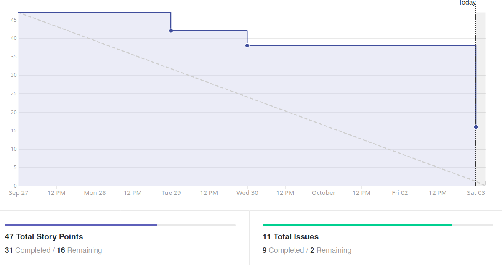
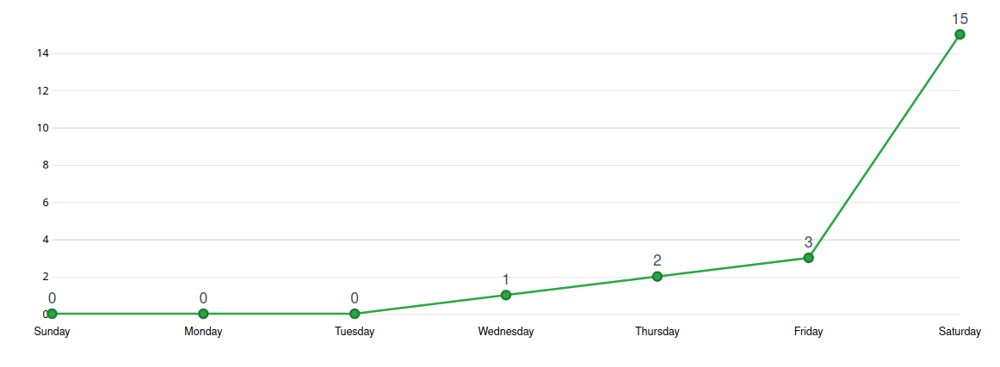
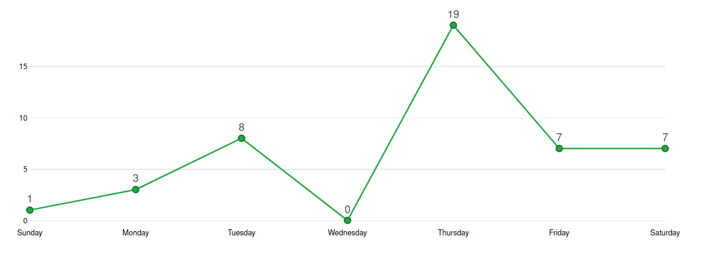
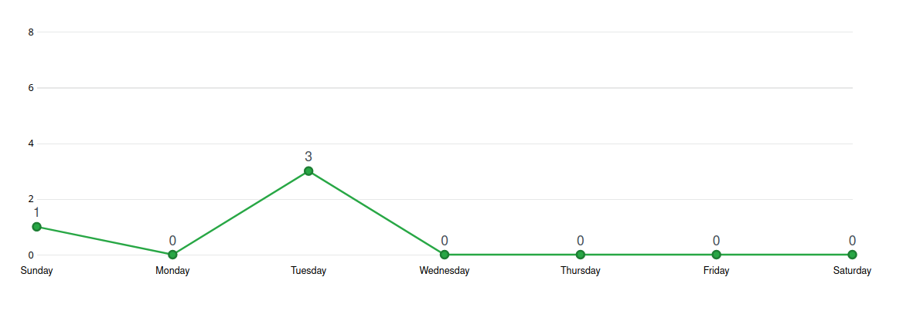

# Análise e Retrospectiva

## 1. Visão Geral
**Número da Sprint:** 6    
**Data de Início:** 27/09/2020    
**Data de Término:** 03/10/2020   
**Duração:** 7 dias  
**Pontos Planejados:** 47 pontos  
**Pontos Entregues:** 31 pontos  
**Dívida Técnica:** 16 pontos  
**Membros Ausentes:** Luiz Pettengill

## 2. Resultados
### 2.1 Repositório Docs
1. **História:** [#60 - Documentar Metodologia](https://github.com/fga-eps-mds/2020.1-stay-safe-docs/issues/60)    
**Responsáveis:** Renan     
**Pontuação:** 3  
**Status:** Concluído    
2. **História:** [#61 - Customizar mkdocs](https://github.com/fga-eps-mds/2020.1-stay-safe-docs/issues/61)    
**Responsáveis:** Sara e Lucas    
**Pontuação:** 5    
**Status:** Concluído        
3. **História:** [#62 - Revisar e corrigir documentos e READMEs](https://github.com/fga-eps-mds/2020.1-stay-safe-docs/issues/62)    
**Responsáveis:** Renan, Rossicler e Sara  
**Pontuação:** 8      
**Status:** Não Concluído       
4. **História:** [#63 - Atualizar e finalizar protótipo](https://github.com/fga-eps-mds/2020.1-stay-safe-docs/issues/63)    
**Responsáveis:** Renan e Brenda  
**Pontuação:** 5    
**Status:** Concluído    
5. **História:** [#67 - Documentar Sprint 6](https://github.com/fga-eps-mds/2020.1-stay-safe-docs/issues/67)    
**Responsáveis:** Renan  
**Pontuação:** 3      
**Status:** Concluído    

### 2.2 Repositório Frontend
1. **História:** [#21 - Associar ocorrência a uma localização no mapa](https://github.com/fga-eps-mds/2020.1-stay-safe-front-end/issues/21)    
**Responsáveis:** Lucas e Hérick  
**Pontuação:** 5   
**Status:** Concluído    
2. **História:** [#22 - Visualizar cidades em formato de mapa de calor](https://github.com/fga-eps-mds/2020.1-stay-safe-front-end/issues/22)    
**Responsáveis:** Daniel e Luiz    
**Pontuação:** 8     
**Status:** Não Concluído    
3. **História:** [#23 - Visualizar, editar e deletar ocorrências cadastradas](https://github.com/fga-eps-mds/2020.1-stay-safe-front-end/issues/23)    
**Responsáveis:** Ítalo e Tiago    
**Pontuação:** 5   
**Status:** Concluído    
4. **História:** [#26 - Configurar CI](https://github.com/fga-eps-mds/2020.1-stay-safe-front-end/issues/26)    
**Responsáveis:** Rossicler     
**Pontuação:** 1     
**Status:** Concluído    

### 2.3 Repositório User-Service
1. **História:** [#25 - Configurar CI](https://github.com/fga-eps-mds/2020.1-stay-safe-user-service/issues/25)    
**Responsáveis:** Rossicler    
**Pontuação:** 2  
**Status:** Concluído    

### 2.4 Repositório Secretary-Service
1. **História:** [#20 - Configurar CI](https://github.com/fga-eps-mds/2020.1-stay-safe-secretary-service/issues/20)    
**Responsáveis:** Rossicler    
**Pontuação:** 2   
**Status:** Concluído    

## 3. Velocity

## 4. Burndown

### 4.1 Burndown Review/QA

## 5. Gráfico de Contribuições

### 5.1 Contribuições na Documentação

### 5.2 Contribuições no Frontend

### 5.3 Contribuições no User-Service

### 5.4 Contribuições no Secretary-Service

## 6. Retrospectiva
### Pontos Positivos
* Revisão de PRs por MDS
* Membros de MDS estão ajudando os de EPS com as demandas
* Aprendizado com os erros (em termos de planejamento, priorização, entre outros)

### Pontos Negativos
* Problemas com a estação de trabalho de um membro
* Provas e trabalhos de outras disciplinas
* Falha na metodologia ao colocar issues como concluídas sendo que não estavam prontas
* Falta de padrão entre typescript e javascript
* Falta de planejamento entre dependências
* Falta de comprometimento de um membro de MDS

### Melhorias 
* Ser mais rígido na aplicação da metodologia
* Usar as ferramentas do GitHub para esclarecer melhor as dependências
* Padronizar o código no frontend

## 7. Quadro de Conhecimentos

## 8. Análise do Scrum Master
### Time
Sétima sprint do projeto, sendo a última sprint completa antes da Release 1, marcada por duas dívidas técnicas e uma quantidade de pontos acima do Velocity da equipe. Essa sprint conteve muitas ativadades de outras disciplinas (como provas e trabalhos) tanto pra MDS como pra EPS e prejudicou muito a produtividade do time. O planejamento foi muito otimista e não levou tão a sério os riscos apontados. As duas issues não entregues foram de 8 pontos, o que novamente demonstra que nossa equipe trabalha melhor com diversas issues pequenas do que com poucas issues grandes.

Nos pontos positivos vale destacar o excelente comportamento de alguns membros de MDS que ao terminarem suas demandas foram ajudar nas outras demandas do grupo, a revisão de PRs parcial por MDS também está funcionando e garantiu algumas funcionalidades entregues com antecedência e retirou um pouco da sobrecarga em cima de EPS. 

Como ponto negativo também relatamos uma falha grave do grupo na aplicação da metodologia, os documentos relacionados a **Custos e Qualidade** planejados e teoricamente encerrados na Sprint 5, foram iniciados no meio da semana e seriam finalizados no dia seguinte ao fim da Sprint 5, então as issues deles foram fechadas, mas houveram intercorrências e estes documentos não foram concluídos. O time tem noção que essa é uma prática péssima pra metodologia ágil e se compromete a não fazer mais isso. Da próxima vez que ocorrer um episódio semelhante a issue será considerada débito técnico.

### Métricas
Na Sprint 6 foram concluídos 31 pontos dos 47 planejados, o **Velocity** atual da equipe é de 42.86 pontos com sete sprints fechadas e 300 pontos entregues no total.

O **Burndown** da Sprint 6 mostra que a maioria das tarefas foi concluída no último dia. Ao visualizarmos o Burndown considerando a fase de Review/QA como final podemos verificar que o comportamento da sprint em termos de velocidade de revisão/aprovação de PRs foi bom, uma melhora em relação a sprint passada.

Os **Históricos de Contribuição** apresentam uma quantidade grande de commits no meio da sprint, que é o comportamento esperado, o único ponto a ser melhorado é evitar o pico de commits no último dia, que indica revisões e merges tardios. O que pudemos notar é que em vários PRs acabou faltando um review para aprovação (dos dois necessários) e maioria dos merges foi feito no último dia.

O **Quadro de Conhecimento** está começando a mostrar evoluções mais lentas agora que os membros estão acostumados a usar as tecnologias em questão.

### Histórias
A issue de frontend **Visualização das cidades por mapas de calor** foi um grande desafio na sprint, um dos membros executores teve problemas de ambiente. A previsão é que ela seja finalizada no início da próxima sprint. As outras duas issues de frontend eram mais simples e saíram sem dificuldades.

Devido ao excesso de compromissos externos a matéria a issue de **Revisão de Documentos** não foi iniciada, ficando como dívida técnica para a próxima sprint. As outras tarefas de documentação e o CI foram concluídos com sucesso.

## Riscos
Entre os riscos monitorados pelo grupo os que ocorreram na sprint foram:

* Divergência de horários entre membros da equipe
* Conflito de dependência entre atividades
* Conflito com outras disciplinas
* Ausência de membros durante reuniões do grupo
* Erros durante o planejamento das atividades
* Falta de comprometimento de membros com o projeto
* Problemas com a estação de trabalho

Os quatro primeiros riscos eram esperados no planejamento e foi possível realizar algumas ações preventivas e reativas, em relação aos outros riscos só tomamos as ações reativas.