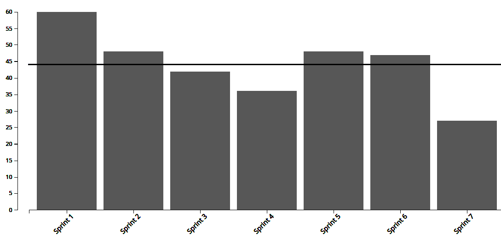
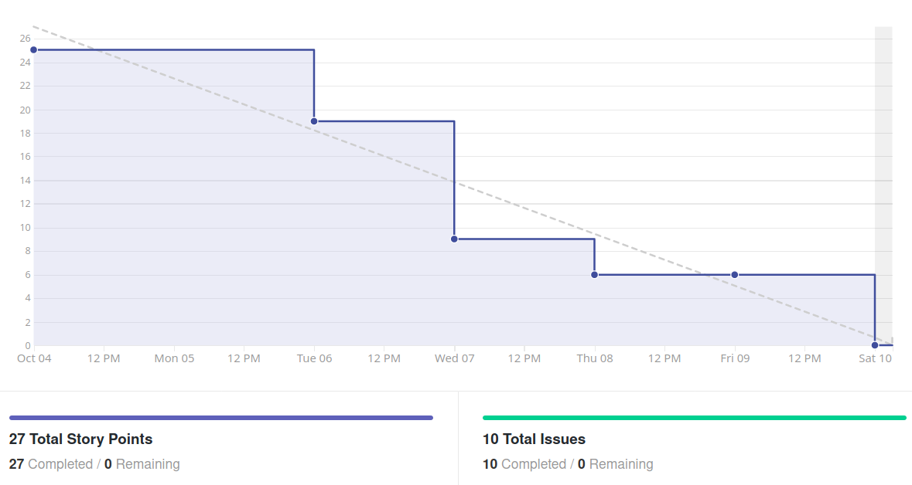
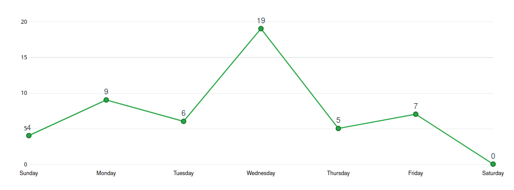
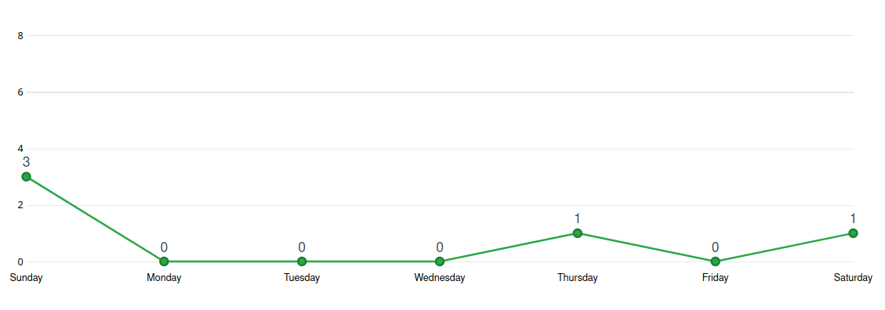

# Análise e Retrospectiva

## 1. Visão Geral
**Número da Sprint:** 7      
**Data de Início:** 04/10/2020    
**Data de Término:** 10/10/2020   
**Duração:** 7 dias  
**Pontos Planejados:** 43 pontos  
**Pontos Entregues:** 43 pontos  
**Dívida Técnica:** 0 pontos  
**Membros Ausentes:** Luiz Pettengill

## 2. Resultados

### 2.1 Repositório Docs
1. **História:** [#70 - Documentar Agile EVM](https://github.com/fga-eps-mds/2020.1-stay-safe-docs/issues/70)    
**Responsáveis:** Brenda, Renan, Rossicler e Sara       
**Pontuação:** 5  
**Status:** Concluído       
2. **História:** [#71 - Atualizar Backlog do Produto com tasks e diagrama de Gantt](https://github.com/fga-eps-mds/2020.1-stay-safe-docs/issues/71)    
**Responsáveis:** Renan   
**Pontuação:** 3  
**Status:** Concluído           
3. **História:** [#72 - Adicionar padrões recomendados de comunidade aos repositórios](https://github.com/fga-eps-mds/2020.1-stay-safe-docs/issues/72)    
**Responsáveis:** Sara   
**Pontuação:** 2   
**Status:** Concluído         
4. **História:** [#73 - Documentar Sprint 7](https://github.com/fga-eps-mds/2020.1-stay-safe-docs/issues/73)    
**Responsáveis:** Renan  
**Pontuação:** 3      
**Status:** Concluído  

Uma dívida técnica foi herdada da Sprint 6:   

1. **História:** [#62 - Revisar e corrigir documentos e READMEs](https://github.com/fga-eps-mds/2020.1-stay-safe-docs/issues/62)    
**Responsáveis:** Renan, Rossicler e Sara  
**Pontuação:** 8    
**Status:** Concluído     

### 2.2 Repositório Frontend
1. **História:** [#31 - Aplicar padrões ao código](https://github.com/fga-eps-mds/2020.1-stay-safe-front-end/issues/31)    
**Responsáveis:** Ítalo e Hérick    
**Pontuação:** 3  
**Status:** Concluído     
2. **História:** [#32 - Atualizar telas de acordo com o protótipo](https://github.com/fga-eps-mds/2020.1-stay-safe-front-end/issues/32)    
**Responsáveis:** Ítalo e Hérick      
**Pontuação:** 5  
**Status:** Concluído       
3. **História:** [#33 - Mostrar detalhes de uma ocorrência](https://github.com/fga-eps-mds/2020.1-stay-safe-front-end/issues/33)    
**Responsáveis:** Tiago    
**Pontuação:** 3     
**Status:** Concluído  

Uma dívida técnica foi herdada da Sprint 6:  

1. **História:** [#22 - Visualizar cidades em formato de mapa de calor](https://github.com/fga-eps-mds/2020.1-stay-safe-front-end/issues/22)    
**Responsáveis:** Daniel, Luiz e Lucas     
**Pontuação:** 8     
**Status:** Concluído  

### 2.3 Repositório User-Service
1. **História:** [#26 - Configurar ferramenta de cobertura](https://github.com/fga-eps-mds/2020.1-stay-safe-user-service/issues/26)    
**Responsáveis:** Rossicler    
**Pontuação:** 1  
**Status:** Concluído  

### 2.4 Repositório Secretary-Service
1. **História:** [#26 - Configurar ferramenta de cobertura](https://github.com/fga-eps-mds/2020.1-stay-safe-secretary-service/issues/26)    
**Responsáveis:** Rossicler    
**Pontuação:** 2   
**Status:** Concluído     

## 3. Velocity

## 4. Burndown

### 4.1 Burndown Review/QA

## 5. Gráfico de Contribuições

### 5.1 Contribuições na Documentação

### 5.2 Contribuições no Frontend

### 5.3 Contribuições no User-Service

### 5.4 Contribuições no Secretary-Service

## 6. Retrospectiva
### Pontos Positivos
* A Release 1 (R1) foi concluída e tirou um grande peso das costas do grupo
* O grupo teve mais tempo para se preparar para R1 por conta da ausência de aulas de EPS/MDS
* A R1 e o processo de gravação de vídeo uniu mais o grupo
* Com a apresentação da R1 alguns pontos sobre o projeto ficaram mais claros pra todos os membros
* As issues foram feitas com antecedência 

### Pontos Negativos
* Por não ter feedback instantâneo o planejamento da próxima sprint fica sem correções sugeridas pelo professor
* Grupo teve dificuldades para fazer EVM

### Melhorias 
* Sugerir professor ver o vídeo ao vivo com o grupo para feedback instantâneo

## 7. Quadro de Conhecimentos

## 8. Análise do Scrum Master
### Time
Oitava sprint do projeto marcada por ser a sprint da Release 1. Sprint super produtiva, onde as tarefas planejadas foram realizadas (inclusive as dívidas técnicas) e o vídeo para R1 foi gravado. 

Apesar do grande esforço empregado para que todas atividades planejadas fossem entregues o grupo apontou muito mais pontos positivos na retrospectiva, destancando o alívio que foi passar a R1 e o fato de estarmos mais unidos depois de sofrermos juntos no calor durante 5 horas entre ensaios e gravações. Além disso a apresentação fez um nivelamento geral do grupo em relação a vários conceitos que ainda não tinham ficado tão claros.

### Métricas
Na Sprint 7 foram concluídos 43 pontos dos 43 planejados, o **Velocity** atual da equipe é de 44 pontos com oito sprints fechadas e 343 pontos entregues no total. Observamos que em semanas onde identificamos alta probabilidade de riscos chave, como conflito com outras disciplinas e divergência de horários, a equipe consegue entregar entre 35 e 40 pontos, caso contrário a equipe consegue entregar entre 40 e 50 pontos.

O **Burndown** da Sprint 7 mostra o ótimo comportamento da equipe ao finalizar várias tarefas com antecedência, o Burndown considerando a fase de Review/QA evidencia isso ainda mais.

Os **Históricos de Contribuição** apresentam uma quantidade grande de commits no começo e meio da sprint, que é o comportamento esperado, a quantidade pequena de commits no fim da sprint indica um comportamento positivo de tarefas feitas com antecedência.

O **Quadro de Conhecimento** está começando a mostrar evoluções mais lentas agora que os membros estão acostumados a usar as tecnologias em questão.

### Histórias
Para ajudar na conclusão da dívida **Visualização das cidades por mapas de calor** deslocamos um membro extra a ela, a tarefa foi concluída no começo da sprint. Quanto a **Revisão de Documentos** fizemos um esforço conjunto e conseguimos melhorar e atualizar os documentos do projeto que julgamos necessários, estamos bem satisfeitos com estado da documentação após essa revisão.

Houve depêndencia entre algumas issues do frontend nessa sprint, mas o grupo conseguiu administrar isso de maneira eficaz, realizando uma ordem adequada de execução e merges para que esse problema fosse minimizado. 

Para realização do **Vídeo da Release 1** foi criada uma issue, mas essa não foi pontuada, entre ensaios e apresentação o grupo empreendeu um grande esforço para realizá-la. O [vídeo](https://fga-eps-mds.github.io/2020.1-stay-safe-docs/releases/release1/) gerado encontra-se disponível no repositório visual da documentação do grupo.

As demais tarefas são auto-explicativas e ocorreram sem intercorrências.

## Riscos
Entre os riscos monitorados pelo grupo os que ocorreram na sprint foram:

* Divergência de horários entre membros da equipe
* Conflito de dependência entre atividades
* Ausência de membros durante reuniões do grupo
* Erros durante o planejamento das atividades
* Falta de comprometimento de membros com o projeto

Os dois primeiros riscos eram esperados no planejamento e foi possível realizar algumas ações preventivas e reativas, em relação aos outros riscos só tomamos as ações reativas.